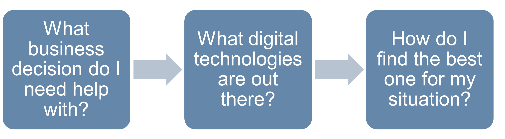
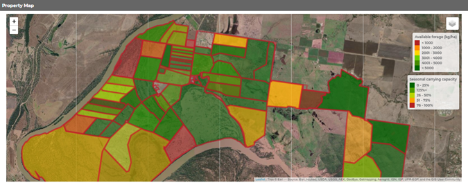
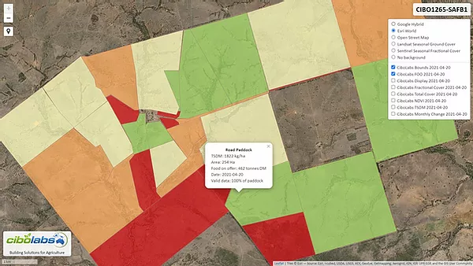
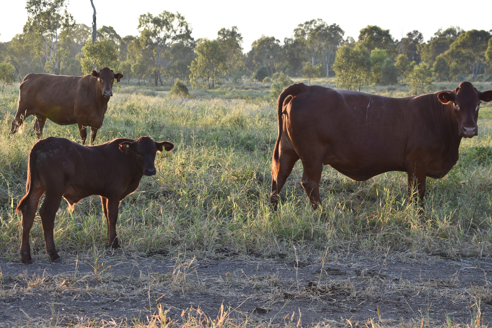

```{r setup, include=FALSE, echo = FALSE}
library(qualtRics)
library(dplyr)
library(knitr)
library(kableExtra)
library(pander)

qualtrics_api_credentials(base_url = "syd1.qualtrics.com", api_key = "F3hJKXRfDwka2FJV3sqqDGCNZuqm46sJC6dVKCgE", install = TRUE,
                          overwrite = TRUE)
readRenviron("~/.Renviron")
df <- fetch_survey(surveyID = "SV_6wXoZMOL6A1ww3Y", force_request = TRUE)
df <- df %>%
  filter(Progress == 100)
df <- df[which.max(df$StartDate),]

interest_1 <- ifelse(df$interest_1 == "Yes, I have what I need" | df$interest_1 == "No, and I'm not interested in knowing more" | 
                       is.na(df$interest_1), FALSE, TRUE)
interest_2 <- ifelse(df$interest_2 == "Yes, I have what I need" | df$interest_2 == "No, and I'm not interested in knowing more" | 
                       is.na(df$interest_2), FALSE, TRUE)
interest_3 <- ifelse(df$interest_3 == "Yes, I have what I need" | df$interest_3 == "No, and I'm not interested in knowing more" | 
                       is.na(df$interest_3), FALSE, TRUE)
interest_4 <- ifelse(df$interest_4 == "Yes, I have what I need" | df$interest_4 == "No, and I'm not interested in knowing more" | 
                       is.na(df$interest_4), FALSE, TRUE)
interest_5 <- ifelse(df$interest_5 == "Yes, I have what I need" | df$interest_5 == "No, and I'm not interested in knowing more" | 
                       is.na(df$interest_5), FALSE, TRUE)
interest_6 <- ifelse(df$interest_6 == "Yes, I have what I need" | df$interest_6 == "No, and I'm not interested in knowing more" | 
                       is.na(df$interest_6), FALSE, TRUE)
interest_3_4 <- ifelse(df$interest_2 == "Yes, I have what I need" | df$interest_3 == "Yes, I have what I need" | 
                         df$interest_2 == "No, and I'm not interested in knowing more" | 
                         df$interest_3 == "No, and I'm not interested in knowing more" | 
                         is.na(df$interest_2) | is.na(df$interest_3), FALSE, TRUE)

```


# AGRITECH CHECK – YOUR NEXT STEPS

The purpose of the CQUni AgriTech Check is to provide you with a guide of the range of technologies available that may be of value to your business.

\begin{wrapfigure}{R}{.5\textwidth}
  \begin{center}
    \vspace{-20pt}
    \includegraphics[width=.5\textwidth]{./Headandfoot/Image.jpg}
    \vspace{-70pt}
  \end{center}
\end{wrapfigure}

This report is not designed to tell you what to purchase, but where to look next and what questions to ask to ensure that you find the right equipment to help you achieve your business objectives.

The key thing to remember when looking to invest is to identify the decision that you want the technology to help you make.

Making the right decisions makes dollars – if a technology doesn't help you do this, it's not worth it.

Ask yourself, will this type of technology:

* Increase my production?

* Reduce my costs?

* Increase my price received?

* Increase my sustainability?

* Make me sleep better at night?


If the answer is "No" to all of these questions, then it is time to think again and find a different focus area within your business for your agtech investment.




`r if(interest_1 == FALSE) {"<!--"}`
\newpage

## DIGITAL FARM MAPPING
You have indicated that you are interested in developing a digital farm map. A digital farm map is like a traditional paper map, but is stored electronically and access by a computer or smartphone.

### What are the benefits?
There are a number of benefits to developing developing a digital farm map and its not as complicated as it initially sounds. A digital farm map allows you get accurate data on the size of your property and individual paddocks.

This data can be useful when estimating stocking rates, planning infrastructure such as new fence lines or watering points, or simply ordering supplies for paddock-based activities like herbicide applications, that require accurate areas of the land to estimate the volume to be ordered.

While traditional paper-based (and acetate overlay) mapping is extremely useful, having a digital farm map opens up access to additional sources of new and useful information.


### How should I go about getting a digital farm map?
There are a number of ways in which you can create a digital farm map. The first option is free-ware, with several mapping systems providing free basic property mapping that are either generic (e.g. Google Earth) or farm specific (e.g. Data Farming). 

There are also a number of farm-specific systems that require a subscription fee (e.g. FarmMap4D). As you might have guessed, the free platforms have limited capabilities while the systems that cost money offer more customised features. 

Some systems have been developed with specific farm industries in mind – for example, Data Farming was primarily developed for cropping – or even specific regional industries, with Farm Map 4D focusing on northern beef production systems. 

While the basic functionality required of digital farm maps can be achieved using one of the free systems, if you choose to use one of these services be prepared to do a bit of learning for yourself as there will be little (if any) customer support. 

Some of the more advanced digital farm mapping systems allow you to access the data on a smartphone or tablet whilst out in the paddock. This usually – although not always – requires your device to have internet connectivity. This feature can be really handy if you're trying to input data into your mapping system while out in the paddock.

One key thing to look out for is the ability to export the data from your farm mapping system in a format that can be input into other mapping systems. If at some point you want to change to a new or more advanced mapping system, having an export function means you can simply take it out of the existing system and upload it into the new one. 

Commonly used file formats include the “shape” file format (.shp and other files associated) and Google’s “kml” (files ending .kml or .kmz).

### Where to start?
If you are only just starting out, the best place to begin is by downloading Google Earth Pro. This is a free platform and will provide you with some very basic mapping functionality. It will allow you to “digitise” in your farm and paddock boundaries, which is simply drawing boundaries lines over a background satellite image.

\renewcommand{\arraystretch}{2}
```{r mapsupplier, echo = FALSE}
mapsup <- read.csv("./Headandfoot/mapsup.csv", stringsAsFactors = FALSE)
colnames(mapsup)[5] <- "Are they at Beef21?"

# knitr::kable(mapsup, align = "lllll", row.names = FALSE, format = "latex") %>%
#   kable_styling(full_width = F) %>%
#   kableExtra::landscape()
kable(mapsup, "latex", booktabs = T) %>%
  kable_styling(font_size = 8, stripe_color = "lightblue", latex_options = "striped") %>%
  landscape() %>%
  column_spec(column = 1, width = "1in") %>%
  column_spec(column = 2, width = "2.8in") %>%
  column_spec(column = 3, width = "1.8in") %>%
  column_spec(column = 4, width = "2.5in") %>%
  column_spec(column = 5, width = "1in") %>%
  row_spec(0,bold=TRUE)
# pander::pander(mapsup, split.table = Inf)

```

### What questions should I ask?
Your questions should be focussed on the specific application of the farm map you are going to develop to meet your business objective. Here are a few suggestions to get you started:

* Does the price include all mapping features or do I need to pay more for additional services once I’ve started using the system?

* Does the system provide 3-dimensional landscape mapping (important for planning reticulated watering systems)?

* Can I import other mapping files (e.g. .shp or .kml) into this system, or do I have to start from scratch?

* Can I export the map I created in a standard geographical information file format (e.g. a shape file or .kml)? (This is important as it allows you to change to a different provider later down the track without having to redo all your maps)

* Does the farm mapping system allow me to take the map out into the field on a smartphone or tablet? And will it work offline?

* Does the map integrate into any other farm management software? If so, what? 

\vspace{40pt}


`r if(interest_1 == FALSE) {"-->"}`


`r if(interest_2 == FALSE) {"<!--"}`
\newpage

## FEED BASE MONITORING
You have indicated that you are interested in feed base monitoring, recording, and management technologies. These systems allow you to collect feed base data and interrogate it to improve decision making around pasture management. There are broadly two parts to these - the first is the system that manages the data and does calculations to match feed to demand, the second (and less common) is the sensor system to automate the collection of pasture measurements.

### What are the benefits?
Recording data on the amount and quality of pasture and matching this with the nutritional demands of grazing livestock improves the productivity of both your pastures and your livestock. Some producers in northern Australia estimate that this could improve returns by as much as \$80/AE (MLA Report B.NBP.0549). In Southern grazing systems, improved feed-base management has been estimated to be worth over \$50/ha of increased profit (MLS Report B.GSM.0004).

### How should I go about selecting a feed-base monitoring, recording, and management system?
There are many ways to approach this - one of the first steps is to understand your production system and the key information required to make better decisions around feed budgeting.

In Northern Australia, one of the key decisions to be made is setting the long term carrying capacity of your property. This is best done using one of the digital farm mapping platforms that incorporate this function and assess land area against long term safe carrying capacity recommendations. A good starting point to assist you in determining your long term carrying capacity is to get in touch with your state's department of primary industries. For Queenslanders, check out the Queensland Government's Long Paddock initiative (www.longpaddock.qld.gov.au/forage/), which generates a carrying capacity report that is sent to your email.

In pastoral regions, the next level of more refined management involves short and medium term paddock feed budgeting. This involves calculating the amount of feed available and the likely demand from livestock. A good place to start learning about this is the freely available Future Beef Stocktake Plus app (developed by MLA and QDAFF).

In more intensive Southern Australian grazing systems where rotational grazing may be used, a more refined feed base management system may be of value. These allow you to plan around multiple paddock rotations and more dynamic pasture growth characteristics. Some systems use direct biomass measures (kg/ha), whilst others use animal grazing days. The end result (working out the balance of feed available and feed demand) is basically the same.


### Getting started
If you have never undertaken a pasture budget before and have access to a smartphone, try downloading the StockTake Plus app or exploring MLA's freely available Stocking Rate Calculator or Feed base planning and budgeting tool within a web browser.

If you are already familiar with some basic feed budgeting, then it would be worth exploring some of the more advanced systems that integrate mapping, sensing, and rotational planning.

\newpage

\begin{wrapfigure}{R}{.4\textwidth}
  \begin{center}
    \vspace{-20pt}
    \includegraphics[width=.4\textwidth]{./Headandfoot/pasture1.png}
    \caption{An example of a photo reference used for comparison with your pastures. Source: StockTake Plus.}\
  \end{center}
\end{wrapfigure}

One of the key challenges in this area is obtaining good estimates of pasture quality and quantity to input into the calculations. A simple, accurate, and free way to do this is to directly measure using quadrat cuts, but this is very time consuming. A quicker way is to use photo references, which are available in some systems.

Another technique for assessing pasture involves the use of satellite sensing. Data from satellite imagery is converted to biomass measures (more commonly DMkg/ha). These systems are usually integrated with a farm mapping package and present data visually as a map. Some of these systems will require you to undertake periodic calibrating cuts and while this is time consuming, will increase the accuracy of the estimates the system provides you.

One final piece of information that is required to complete a feed budget is the growth rate of the pasture (expressed as DMkg/ha/day). This information is most commonly derived from plant growth modelling, based on weather data and some satellite data. You can get estimates of growth rates from places like the Long Paddock FORAGE system (www.longpaddock.qld.gov.au/forage/). Some systems infer this growth from rainfall directly as a change to the potential animal grazing days and many producers find this a more intuitive way of handling the data.

\vspace{30pt}



\renewcommand{\arraystretch}{2}
```{r feedbasesupplier, echo = FALSE}
feedsup <- read.csv("./Headandfoot/feedsup.csv", stringsAsFactors = FALSE)
colnames(feedsup)[5] <- "Are they at Beef21?"
colnames(feedsup)[1] <- "Supplier"

# knitr::kable(feedsup, align = "lllll", row.names = FALSE, format = "latex") %>%
#   kable_styling(full_width = F) %>%
#   kableExtra::landscape()
kable(feedsup, "latex", booktabs = T) %>%
  kable_styling(font_size = 8, stripe_color = "lightblue", latex_options = "striped") %>%
  landscape() %>%
  column_spec(column = 1, width = "1in") %>%
  column_spec(column = 2, width = "2.8in") %>%
  column_spec(column = 3, width = "1.8in") %>%
  column_spec(column = 4, width = "2.5in") %>%
  column_spec(column = 5, width = "1in") %>%
  row_spec(0,bold=TRUE)
# pander::pander(feedsup, split.table = Inf)

```

### What questions should I ask?

* Is this system design for my particular region and operation?

* What is the cost of different features of the system? Will I need to buy more advanced modules later on?

* Where is the data stored once I input it into your system?

* What data do I need to input into the system? E.g. current biomass, growth rates, wastage.

* How does the system display the information? Does it provide a visualisation of all the information you need to make the key decisions?

* If you have more than one person on the property, can the system handle multiple users and data updates (particularly when offline and out of WiFi/cell coverage)?

`r if(interest_2 == FALSE) {"-->"}`


`r if(interest_3_4 == FALSE) {"<!--"}`
\newpage

## DATA MANAGEMENT
Data is becoming an increasingly important and valuable resource. How you manage and secure your data will impact the value you get from it.

The National Farmers Federation estimate that data driven solutions in the agriculture sector can potentially drive another $20.3 billion to the annual national farm output. However, they also note that most producers want to know what is happening with their data, who is getting access to it, and are unsure who they can trust.

So what is data? In the context of your business, data is any recorded information that can be used to describe any part of your business. Data has to have two key parts – an "object" and a "value". The value will usually be defined by units of measure, for example, a monetary value ($) or a weight value (kg). The value of the object allows you to describe and compare the performance of different parts of your business.

Enough technical talk! The critical thing to remember when looking at your data is to identify what and how an object (animal, paddock, etc.) is being described. Ideally, consistent long-term descriptions of your business will help you to better assess how your business is performing and what you can do to improve it.

### Getting started
Data is increasingly being captured and stored as digital records, however, a notebook with hand written notes is also a form of data. Digital data collection and sharing tools mean that you are now facing a deluge of data records. Some of these data are related to your business, but may have been collected by somebody else and you will need to track it down to get access to it.

There are also many software and hardware companies that can provide you with valuable assistance in colelcting, storing, analysing, and reporting your data. It can be overwhelming trying to determine what is the best technical solution for your business. Before diving in and committing, take some time to work out a data plan and ask yourself a few key questions:

* What data can you already access?

* Where is your data currently sitting?

* Do you own the data?

* How often is the data updated?

* What critical data are you currently not able to access?

* How do you want to collect the new data? Do you want to automate it?

* What do you want to do with the data? What do you want to better understand and aim to improve?

* What current systems are you happy to use to manage and store your data?

Remember that being able to compare data will provide you with information, giving insight and knowledge that will help improve business decisions.

\renewcommand{\arraystretch}{2}
```{r datamanagementsupplier1, echo = FALSE}
datsup <- read.csv("./Headandfoot/datsup.csv", stringsAsFactors = FALSE)
colnames(datsup)[5] <- "Are they at Beef21?"
datsup1 <- datsup[c(1:9),]
datsup2 <- datsup[c(10:12),]

kable(datsup1, booktabs = T) %>%
  kable_styling(font_size = 8, stripe_color = "lightblue", latex_options = "striped") %>%
  landscape() %>%
  column_spec(column = 1, width = "1in") %>%
  column_spec(column = 2, width = "2.8in") %>%
  column_spec(column = 3, width = "1.8in") %>%
  column_spec(column = 4, width = "2.5in") %>%
  column_spec(column = 5, width = "1in") %>%
  row_spec(0,bold=TRUE)

```

\newpage

```{r datamanagementsupplier2, echo = FALSE}
kable(datsup2, row.names = FALSE, booktabs = T) %>%
  kable_styling(font_size = 8, stripe_color = "lightblue", latex_options = "striped") %>%
  landscape() %>%
  column_spec(column = 1, width = "1in") %>%
  column_spec(column = 2, width = "2.8in") %>%
  column_spec(column = 3, width = "1.8in") %>%
  column_spec(column = 4, width = "2.5in") %>%
  column_spec(column = 5, width = "1in") %>%
  row_spec(0,bold=TRUE)

```


### What questions should I ask?
When you are ready to invest in software or hardware, ask many questions. Make sure the data management system allows you to meet your business goals.

Ask the supplier of the equipment questions, for example:

* Whether they share your data?

* Who owns the data?

* Where is it stored?

* What happens if the data gets corrupted or lost?

* What support do they provide?

* Are they cloud based or can you access the data locally? If you have poor internet connection, you need to make sure you can access the data even if the internet is not working.

* What format is the data stored in? Can you easily import it to your own system that you are familiar with? Can they provide some example data so you can test how it works?

* Do they provide mobile and desktop tools? If you work mostly on your mobile device, then this might be critical for you getting value from your data.

* Do they provide any data processing and analyses? And if so, what and how is it done and can you access the results?

* Can you incorporate historical data into any data storage tools?

* How does the data management tool help you meet your data driven goals that you outlined earlier?

There are no right or wrong answers to these questions, but they should help you better understand what you are purchasing.

`r if(interest_3_4 == FALSE) {"-->"}`


`r if(interest_3 == FALSE) {"<!--"}`
\newpage
## HERD AND ANIMAL PRODUCTION DATA RECORDING SYSTEMS
Recording data on your herd, or even better, each animal, provides valuable information for decision making. Many people use a simple paper herd book, which is great, however, developing a digital recording system can provide more powerful insights into your business. Digital systems can also be backed up so that the data is not lost (when written records disappear). Data management systems most commonly require you to record the identity of an animal or herd along with a characteristic. These characteristics might be as simple as pregnancy or calving status, through to more complex information like liveweight gain.

One of the key requirements of these systems is to have a good identification system for animals. This is most commonly a visual identification ear tag, however, the RFID (NLIS) ear tag can also be used to automate the process of data collection. This is particularly the case for the collection of liveweight data using scales in the stockyards.

### What are the benefits?
The key benefits of collecting data on herd and animal productivity come about when key decisions are being made. These might be decisions around selection of heifers for retention, which cows to cull, or when to sell animals based on market specifications.

More advanced animal management software systems will integrate with the National Livestock Identification System and can streamline the paperwork associated with animal sales and transfers.

Using a data management system in conjunction with a set of yard scales can provide key data for animals being sold into a grid based pricing system. Knowing liveweight data, and growth rate data, makes it more likely that you can meet the market specifications.

### Where to start?
You can start recording simple animal data in a basic software system without too much financial outlay. Recording simple data, like which cows have calved and when, can be done without buying any expensive sensors. Many software systems provide free trials to their platforms, which are worth investigating. If you think you want to do more than simply record basic animal data in the future, it is worth exploring what each system can do in addition to these features. When it comes to recording data, nothing beats when you're out in the paddock or in the yards - double shuffling data from a notebook to the computer back in the office takes time. Many software systems have a smartphone app, which allows you to input data wherever you are. This can be really useful, but you need to check that these systems will still work offline or in areas of poor connectivity.

\begin{center}
\includegraphics[width=.7\textwidth]{./Headandfoot/Herd1.png}
\end{center}

\newpage

### Who supplies this service?
There are broadly three categories of suppliers in this space - the first are animal identification systems (usually ear tags), the second are the animal measurement system suppliers (weigh scales), and the third are software providers.

\vspace{15pt}

**Animal identification technologies**

\renewcommand{\arraystretch}{2}
```{r herdsupplier1, echo = FALSE}
herdsup1 <- read.csv("./Headandfoot/herdsup_animalid.csv", stringsAsFactors = FALSE)
colnames(herdsup1)[5] <- "Are they at Beef21?"
herdsup1$Costs <- ""

kable(herdsup1, booktabs = T) %>%
  kable_styling(font_size = 8, stripe_color = "lightblue", latex_options = "striped") %>%
  column_spec(column = 1, width = "1in") %>%
  column_spec(column = 2, width = "1.5in") %>%
  column_spec(column = 3, width = "0.5in") %>%
  column_spec(column = 4, width = "1.5in") %>%
  column_spec(column = 5, width = "1in") %>%
  row_spec(0,bold=TRUE)

```

**Animal measurement technologies**

```{r herdsupplier2, echo = FALSE}
herdsup2 <- read.csv("./Headandfoot/herdsup_animalmeasurement.csv", stringsAsFactors = FALSE)
colnames(herdsup2)[5] <- "Are they at Beef21?"
herdsup2$Costs <- ""

kable(herdsup2, booktabs = T) %>%
  kable_styling(font_size = 8, stripe_color = "lightblue", latex_options = "striped") %>%
  column_spec(column = 1, width = "1in") %>%
  column_spec(column = 2, width = "1.5in") %>%
  column_spec(column = 3, width = "0.5in") %>%
  column_spec(column = 4, width = "1.5in") %>%
  column_spec(column = 5, width = "1in") %>%
  row_spec(0,bold=TRUE)
```

**Software suppliers**

```{r herdsupplier3, echo = FALSE}
herdsup3 <- read.csv("./Headandfoot/herdsup_software.csv", stringsAsFactors = FALSE)
colnames(herdsup3)[5] <- "Are they at Beef21?"
herdsup3$Costs <- ""

kable(herdsup3, booktabs = T) %>%
  kable_styling(font_size = 8, stripe_color = "lightblue", latex_options = "striped") %>%
  column_spec(column = 1, width = "1in") %>%
  column_spec(column = 2, width = "1.5in") %>%
  column_spec(column = 3, width = "0.5in") %>%
  column_spec(column = 4, width = "1.5in") %>%
  column_spec(column = 5, width = "1in") %>%
  row_spec(0,bold=TRUE)

```

`r if(interest_3 == FALSE) {"-->"}`


`r if(interest_4 == FALSE) {"<!--"}`
\newpage
## ON-ANIMAL SENSORS AND VIRTUAL FENCING
You have indicated that you are interested in using on-animal sensors or virtual fencing technologies.

These technologies are only really now emerging in the beef industry. This means that they may not necessarily "work out of the box", and you need to expect to be an "early adopter" and you will likely be involved in the development process. These technologies are great candidates for on-farm research and development projects, such as MLA's Producer Demonstration Site program.

### What are the benefits?
On-animal sensors
On-animal sensors, a.k.a smart tags, allow animals to be monitored 24 hours a day 7 days a week, a frequency that cannot be achieved through physical observation of animals alone. The frequent monitoring means that it is possible to remotely obtain up to date information about your animals, with the potential to diagnose a range of issues in a timely manner.

The information gathered by on-animal sensors fall into two broad categories: location and behaviour. Location sensors (GPS/GIS) collect information on the location of animals and can be used to assist producers to remotely locate animals to improve mustering times, understand grazing distributions of animals, and/or understand water source usage. Behaviour sensors (accelerometers and IMU) collect information on the movement of an animal and can be used to determine what behaviour that animal is exhibiting, i.e. standing, grazing, walking, or ruminating. This information can be used to help identify changes in daily behaviour and alert to instances where an animal's physiological state has changed, i.e. that an animal is lame, impacted by disease or other health issues, experiencing oestrus, or has started calving.

`r if(interest_4 == FALSE) {"-->"}`


`r if(interest_5 == FALSE) {"<!--"}`
\newpage

## Objective genetic measurement tools
You have indicated that you are interested in using objective genetic measurement tools. So let's get started!

### What are the benefits?
There are a number of benefits to utilising objective genetic measurement and selection tools, the most important of which is accelerating the rate of improvement in your herd so that you can maximise your business returns.

When used in conjunction with visual selection techniques (AgTech is designed to complement these methods, not replace them), genetic measurement tools can support joining and culling decisions, ultimately increasing the rate of herd improvement.

The end results will depend on your business focus, and can include more beef per hectare, higher joining and calving rates, a shorter tail in your mob, faster growth rates, better fat cover, improved calving and weaning weights, or simply more confidence that you have purchased the right bull on sale day.

Objective genetic selection tools take the guess work out of your decisions by identifying those animals with the most genetic potential for your business, across the mob and right down to the individual animal level.

### Where do I start?
The starting point is defining your breeding objective. Whether you are a stud or commercial breeder, this will influence the types of technology you need to achieve that breeding objective.

For breeders investigating the objective selection technologies for the first time, your next stop should be a visit to your local beef genetics extension officer, or attending a BullSelect workshop run by either Southern Beef Technology Services (SBTS) or Tropical Beef Technology Services (TBTS).

Starting out requires an understanding of how the different genetic traits are measured and how to understand the data that is provided by BREEDPLAN and stud breeders. One fo the oldest forms of AgriTech is a pen and paper, so come with an open mind and be ready to learn!

This information will help you on sale day when interpreting Estimated Breeding Values (EBVs), which predict how progeny are likely to perform. EBVs are provided by studs so that you can select the right bull to improve your herd in the areas which affect your business's profit drivers.

\newpage

### Where to next?
Once you understand what is measured and how that information is interpreted, the next step on the tech journey is measuring your own animals' performance. Performance recording can be as simple as using NLIS technology - wand or panel readers - to record animal identification within herd management software and relevant information about each animal, such as weight at weaning. You can then connect additional technologies to add genetic measures to your herd recording, such as pregnancy testing, to add further value to your genetic records.

Studs or more intensive breeding operations can use this information when using artificial insemination technologies to maximise the use of the most advanced genetics in the herd.

If you are a stud breeder participating in BREEDPLAN, you will need to comply with its performance recording protocols, which have been implemented to ensure consistency in data gathering and analysis methods across a wide range of traits. This improves the accuracy of EBVs for both vendors and buyers of breeding cattle.

The more breeders that participate in BREEDPLAN, the more accurate EBVs become, as do the predictions made from DNA testing. DNA testing is the most advanced form of objective genetic assessment technolgoy available, with tests available that are customised to both stud and commercial producers, and for different breeds.

However, the range of traits that can be currently tested for beef cattle is limited - use of DNA technology therefore should be aligned with your business and breeding objectives to ensure you obtain maximum value from the information provided.

\vspace{20pt}



\renewcommand{\arraystretch}{2}
```{r geneticssupplier1, echo = FALSE}
gensup <- read.csv("./Headandfoot/gensup.csv", stringsAsFactors = FALSE)
colnames(gensup)[5] <- "Are they at Beef21?"
gensup1 <- gensup[c(1:9),]
gensup2 <- gensup[c(10:19),]
gensup3 <- gensup[c(20:21),]

# knitr::kable(mapsup, align = "lllll", row.names = FALSE, format = "latex") %>%
#   kable_styling(full_width = F) %>%
#   kableExtra::landscape()
kable(gensup1, booktabs = T) %>%
  kable_styling(font_size = 8, stripe_color = "lightblue", latex_options = "striped") %>%
  landscape() %>%
  column_spec(column = 1, width = "1in") %>%
  column_spec(column = 2, width = "2.8in") %>%
  column_spec(column = 3, width = "1.8in") %>%
  column_spec(column = 4, width = "2.5in") %>%
  column_spec(column = 5, width = "1in") %>%
  row_spec(0,bold=TRUE)

```

\newpage

```{r geneticsupplier2, echo = FALSE}
kable(gensup2, row.names = FALSE, booktabs = T) %>%
  kable_styling(font_size = 8, stripe_color = "lightblue", latex_options = "striped") %>%
  landscape() %>%
  column_spec(column = 1, width = "1in") %>%
  column_spec(column = 2, width = "2.8in") %>%
  column_spec(column = 3, width = "1.8in") %>%
  column_spec(column = 4, width = "2.5in") %>%
  column_spec(column = 5, width = "1in") %>%
  row_spec(0,bold=TRUE)

```

\newpage

```{r geneticsupplier3, echo = FALSE}
kable(gensup3, row.names = FALSE, booktabs = T) %>%
  kable_styling(font_size = 8, stripe_color = "lightblue", latex_options = "striped") %>%
  landscape() %>%
  column_spec(column = 1, width = "1in") %>%
  column_spec(column = 2, width = "2.8in") %>%
  column_spec(column = 3, width = "1.8in") %>%
  column_spec(column = 4, width = "2.5in") %>%
  column_spec(column = 5, width = "1in") %>%
  row_spec(0,bold=TRUE)

```

### What questions should I ask?
Your questions should be focussed on your specific breeding objective for your herd. Here are a few suggestions to get you started:

* What genetic traits does the technology report on?

* Is the software compatible with my NLIS reader and the NLIS database?

* Does the paddock-based hardware require an internet connection?

* Can animal data be collected offline and uploaded to the software later?

* Does the service allow you to compare your herd with other animals?

* Does the service allow you to compare the performance of individual animals within your herd?

* Does the service allow you to compare the performance of individual animals between breeds?

* How do I interpret the reports provided by the technology?

* How will the technology help met to select better genetics?

* How do I balance this new information with other insights I have and into the genetic performance of my cattle? E.g. information provided by bull suppliers or visual assessments.

* When reading reports from the technology, which traits or measures should I put the most emphasis on?

* What is the cost of the technology/service? And what financial return should I expect from that investment?

* Do I have to be a member of a breed society to use this technology?

* Can you help me redesign my breeding program to maximise value from your technology?

* I'm going to have more questions later - do you provide after sale support?


`r if(interest_5 == FALSE) {"-->"}`


`r if(interest_6 == FALSE) {"<!--"}`

\newpage
## Financial data recording and/or analysis
Financial data recording and/or analysis

`r if(interest_6 == FALSE) {"-->"}`


