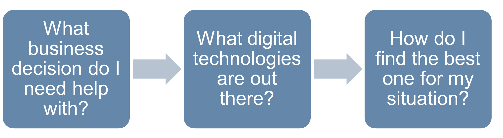
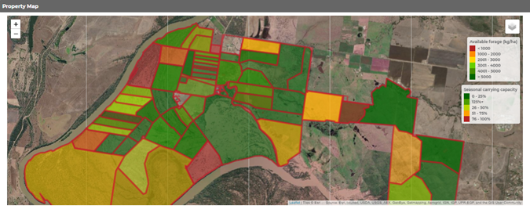

```{r setup, include=FALSE, echo = FALSE}

df <- fetch_survey(surveyID = "SV_6wXoZMOL6A1ww3Y", force_request = TRUE)
df <- df %>%
  filter(Progress == 100)
df <- df[which.max(df$StartDate),]

name <- ifelse(is.na(df$name), FALSE, TRUE)
interest_1 <- ifelse(df$interest_1 == "Yes, I have what I need", FALSE, TRUE)
interest_2 <- ifelse(df$interest_2 == "Yes, I have what I need", FALSE, TRUE)
interest_3 <- ifelse(df$interest_3 == "Yes, I have what I need", FALSE, TRUE)
interest_4 <- ifelse(df$interest_4 == "Yes, I have what I need", FALSE, TRUE)
interest_5 <- ifelse(df$interest_5 == "Yes, I have what I need", FALSE, TRUE)
interest_6 <- ifelse(df$interest_6 == "Yes, I have what I need", FALSE, TRUE)


```


# AGRITECH CHECK – YOUR NEXT STEPS

The purpose of the CQUni AgriTech Check is to provide you with an objective guide of the range of technologies available that may be of value to your business.

\begin{wrapfigure}{R}{.5\textwidth}
  \begin{center}
    \vspace{-20pt}
    \includegraphics[width=.5\textwidth]{./Headandfoot/Image.jpg}
    \vspace{-70pt}
  \end{center}
\end{wrapfigure}

This report is not designed to tell you what to purchase, but where to look next and what questions to ask to ensure that you find the right equipment to help you achieve your business objectives.

The key thing to remember when looking to invest is to identify the decision that you want the technology to help you make.

Making the right decisions makes dollars – if a technology doesn't help you do this, it's not worth it.

Ask yourself, will this type of technology:

* Increase my production?

* Reduce my costs?

* Increase my price received?

* Increase my sustainability?


If the answer is "No" to all of these questions, then it is time to think again and find a different focus area within your business for your agtech investment.




\newpage


`r if(interest_1 == FALSE) {"<!--"}`

## Digital farm mapping
You have indicated that you are interested in developing a digital farm map. So let's get started!

### What are the benefits?
There are a number of benefits to developing developing a digital farm map and its not as complicated as it initially sounds. A digital farm map allows you get accurate data on the size of your property and individual paddocks.

This data can be useful when estimating stocking rates, planning infrastructure such as new fence lines or watering points, or simply ordering supplies for paddock-based activities like herbicide applications, that require accurate areas of the land to estimate the volume to be ordered.

While traditional paper-based (and acetate overlay) mapping is extremely useful, having a digital farm map opens up access to additional sources of new and useful information.


### How should I go about getting a digital farm map?
There are a number of ways in which you can create a digital farm map. The first option is free-ware, with several mapping systems providing free basic property mapping that are either generic (e.g. Google Earth) or farm specific (e.g. Data Farming). 

There are also a number of farm-specific systems that require a subscription fee (e.g. FarmMap4D). As you might have guessed, the free platforms have limited capabilities while the systems that cost money offer more customised features. 

Some systems have been developed with specific farm industries in mind – for example, Data Farming was primarily developed for cropping – or even specific regional industries, with Farm Map 4D focusing on northern beef production systems. 

While the basic functionality required of digital farm maps can be achieved using one of the free systems, if you choose to use one of these services be prepared to do a bit of learning for yourself as there will be little (if any) customer support. 

Some of the more advanced digital farm mapping systems allow you to access the data on a smart phone or tablet whilst out in the paddock. This usually – although not always – requires your device to have internet connectivity. This feature can be really handy if you're trying to input data into your mapping system while out in the paddock.

One key thing to look out for is the ability to export the data from your farm mapping system in a format that can be input into other mapping systems. If at some point you want to change to a new or more advanced mapping system, having an export function means you can simply take it out of the existing system and upload it into the new one. 

Commonly used file formats include the “shape” file format (.shp and other files associated) and Google’s “kml” (files ending .kml or .kmz).

### Where to start?
If you are only just starting out, the best place to begin is by downloading Google Earth Pro. This is a free platform and will provide you with some very basic mapping functionality. It will allow you to “digitise” in your farm and paddock boundaries, which is simply drawing boundaries lines over a background satellite image.

\renewcommand{\arraystretch}{2}
```{r mapsupplier, echo = FALSE}
mapsup <- read.csv("./Headandfoot/mapsup.csv", stringsAsFactors = FALSE)
colnames(mapsup)[5] <- "Are they at Beef21?"

# knitr::kable(mapsup, align = "lllll", row.names = FALSE, format = "latex") %>%
#   kable_styling(full_width = F) %>%
#   kableExtra::landscape()
kable(mapsup, "latex", booktabs = T) %>%
  kable_styling(font_size = 8, stripe_color = "lightblue", latex_options = "striped") %>%
  landscape() %>%
  column_spec(column = 1, width = "1in") %>%
  column_spec(column = 2, width = "2.8in") %>%
  column_spec(column = 3, width = "2in") %>%
  column_spec(column = 4, width = "2.5in") %>%
  column_spec(column = 5, width = "1in") %>%
  row_spec(0,bold=TRUE)
# pander::pander(mapsup, split.table = Inf)

```

### What questions should I ask?
Your questions should be focussed on the specific application of the farm map you are going to develop to meet your business objective. Here are a few suggestions to get you started:

* Does the price include all mapping features or do I need to pay more for additional services once I’ve started using the system?

* Does the system provide 3-dimensional landscape mapping (important for planning reticulated watering systems)?

* Can I import other mapping files (e.g. .shp or .kml) into this system, or do I have to start from scratch?

* Can I export the map I created in a standard geographical information file format (e.g. a shape file or .kml)? (This is important as it allows you to change to a different provider later down the track without having to redo all your maps)

* Does the farm mapping system allow me to take the map out into the field on a smart phone or tablet? And will it work offline?

* Does the map integrate into any other farm management software? If so, what? 

\vspace{40pt}


`r if(interest_1 == FALSE) {"-->"}`


\newpage

`r if(interest_2 == FALSE) {"<!--"}`

## Feed-base monitoring
Feed-base monitoring text

`r if(interest_2 == FALSE) {"-->"}`


\newpage

`r if(interest_3 == FALSE) {"<!--"}`

## Herd-level livestock production data
Herd-level livestock production text

`r if(interest_3 == FALSE) {"-->"}`


\newpage

`r if(interest_4 == FALSE) {"<!--"}`

## Individual-level data recording
Individual-level data recording text

`r if(interest_4 == FALSE) {"-->"}`


\newpage

`r if(interest_5 == FALSE) {"<!--"}`

## Genetic evaluation technologies
Genetic evaluation technologies text

`r if(interest_5 == FALSE) {"-->"}`


\newpage

`r if(interest_6 == FALSE) {"<!--"}`

## Financial data recording and/or analysis
Financial data recording and/or analysis

`r if(interest_6 == FALSE) {"-->"}`


